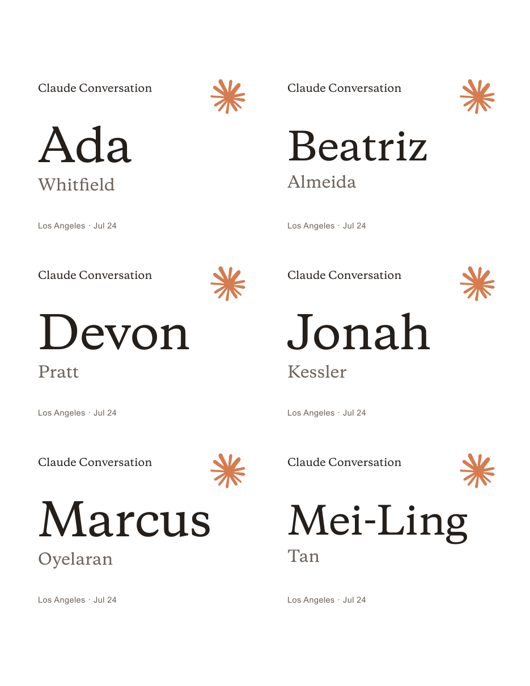
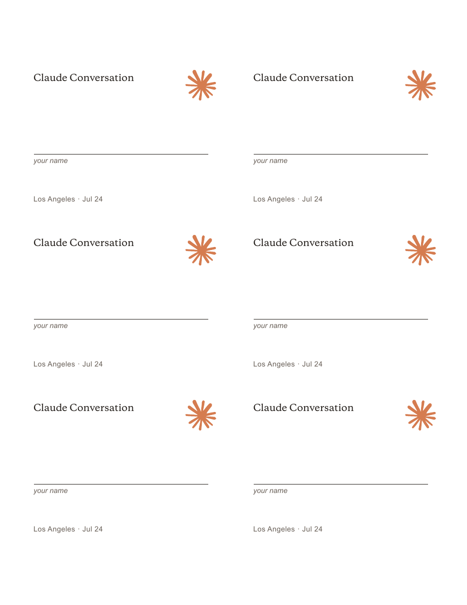

# event-name-badges

A Claude Code skill that turns an attendee list into a **print-ready name badge PDF that lands on the perforations**.

Built for Claude Community Ambassador events and proofed on a real print run (69 badges, LA Claude Conversation, July 2026).



## The problem it solves

Badges are easy to design and easy to get wrong in ways you only discover at the venue:

- printed at "Fit to Page", so every badge sits ~4% off the perforations
- built for Avery 5395 when the box on the table is Avery 74541
- generated from an RSVP export that was already three days stale
- a font that wasn't embedded, so the print shop's copy silently reflowed
- no blanks, so every walk-up spends the event without a name

This skill walks through those checks in order and refuses to skip them.

## Install

```bash
git clone https://github.com/claudeambassador-contrib/event-name-badges.git
cp -R event-name-badges ~/.claude/skills/event-name-badges
```

Claude Code picks it up automatically. Ask for name badges for an event and it loads.

Requirements: Python 3.9+, Google Chrome (the renderer), and optionally
`poppler` (`brew install poppler`) for proof images and font checks, plus
`pypdf` (`pip3 install pypdf`) for the verifier.

## Quickstart

```bash
python3 scripts/make_badges.py \
  --roster sample-roster.csv \
  --stock 74541 \
  --event "Claude Conversation" \
  --city "Los Angeles" \
  --date 2026-07-24 \
  --only-approved \
  --blanks 8 \
  --outdir badges/

bash scripts/render_pdf.sh badges/badges.html
bash scripts/render_pdf.sh badges/badges-blank.html badges/badges-blank-print.pdf
python3 scripts/verify_print.py badges/badges-print.pdf --stock 74541
```

`sample-roster.csv` is included so you can run the whole thing before you have a real list.

## What you get

| File | What it is |
|---|---|
| `badges-print.pdf` | **The file to print.** Named badges, padded to full sheets. |
| `badges-blank-print.pdf` | Blank write-on badges as their own file, so you can run more at the venue without reprinting names. |
| `badges.html` / `badges-blank.html` | Sources. Re-render after any roster change. |
| `PROOF-*-sheet1.png` | Sheet 1 proof to eyeball before you print. |



## Badge anatomy

```
┌──────────────────────────────────────────┐
│ Claude Conversation              ✳       │  ← --event   (required)
│                                          │
│   Ada                                    │  ← from the roster
│   Whitfield                              │
│                                          │
│ Los Angeles · Jul 24                     │  ← --city · --date (both required)
└──────────────────────────────────────────┘
```

Event title, city, and date are all required — the script errors out rather than
printing a blank line where they belong. `--date` accepts ISO (`2026-07-24` becomes
`Jul 24`) or any string you want verbatim.

## Rosters

Name columns are auto-detected across Luma exports, Google Forms, and hand-built
CSVs (`name`, `full name`, `first_name` + `last_name`, and common variants). If a
column can't be found the script says so and lists the headers it saw.

`--only-approved` filters on an approval/status column, keeping rows that read
approved / going / confirmed / attending / accepted.

## Supported stock

| key | stock | per sheet | proofed? |
|---|---|---|---|
| `74541` | Avery 74541 clip-style insert, 4" × 3" | 6 | **Yes** — real print run, 2026-07-23 |
| `5395` | Avery 5395 / 8395 / 45395 adhesive, 3⅜" × 2⅓" | 8 | From Avery's published template |
| `cardstock` | Plain 65–80 lb with crop marks, 4" × 3" | 6 | No |

`python3 scripts/make_badges.py --list-stocks` prints the geometry and tells you
which layouts have actually been printed. See `reference/stock-geometry.md` to add
a stock — the numbers come from the manufacturer's template PDF, never from
measuring a photo.

## Print settings that matter

1. Load the badge stock in the right tray, right face-up orientation.
2. Print at **100% / "Actual Size"** — never "Fit to Page".
3. Single-sided, US Letter, color.
4. **Run one plain-paper test sheet first.** Hold it against a blank badge sheet up
   to a light and confirm the cells land inside the perforations. Do this even on
   proofed stock — printer tray calibration varies.
5. Separate on the perforations and drop into the holders.

Step 4 is the difference between a misprint costing one sheet of paper and costing
the whole box.

## Optional: table numbers

Only for events with assigned seating, which is uncommon. Pass a CSV with
`name,table` via `--tables` and badges sort by table and print the number as a
large numeral bottom-right. The report gains a per-table breakdown and flags
guests with no table plus assignment names missing from the roster.

## Verification

`verify_print.py` reads the actual PDF and checks page size is true US Letter,
page count matches, and every font is embedded. It passes on geometry but always
reminds you that it cannot see your printer's tray offset — the paper test sheet
is still on you.

## Fonts

Two are bundled. **Copernicus** (default) is the Anthropic display serif, correct
for Claude community events. **Lora** (`--font lora`, SIL Open Font License) is
there for non-Claude events or anywhere Copernicus licensing doesn't apply. Both
embed as base64 so the HTML renders identically anywhere, including at a print shop.

See [NOTICE](NOTICE) for asset ownership.

## Contributing

Printed on a stock that isn't listed? Add its geometry to `STOCKS` in
`scripts/make_badges.py`, record what you proofed and when in the `verified`
field, and open a PR. That field is shown to every future user, so it's the most
valuable thing you can contribute.

MIT licensed — see [LICENSE](LICENSE).
